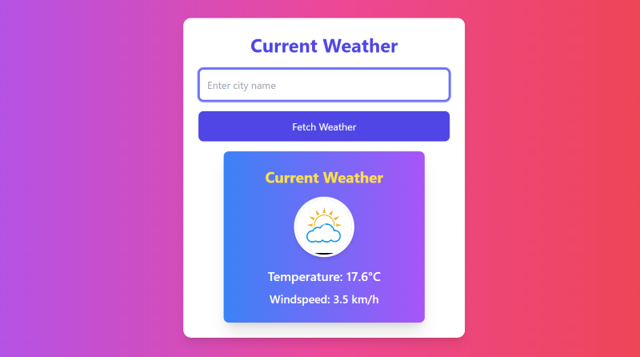
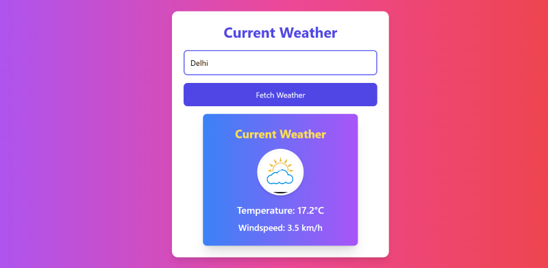

# Weather Now

Weather Now is a web application that allows users to quickly check current weather conditions for any city. Built for outdoor enthusiasts like Jamie, this app provides up-to-date weather information, using the Open-Meteo API.

## Features

- **Current Weather**: View current weather details for any city.
- **Search by City**: Simply enter a city name to see the weather information.
- **Responsive Design**: Optimized for desktop and mobile views.

## Preview

You can check out a live preview of the app on [StackBlitz](https://stackblitz.com/edit/github-vsi5qn?file=README.md).

## Screenshots

Here are some screenshots of the UI:

- **Home Screen**:  
  

- **Weather Search**:  
  

## Getting Started

### Prerequisites

- Node.js and npm installed
- Vite setup for a faster development experience

### Setup Instructions

Follow these steps to get the project up and running locally:

1. **Clone the repository**:
   ```bash
   git clone https://github.com/Shreeram23091/Weather-Now.git
   ```
2. **Navigate into the project directory**:
   ```bash
   cd Weather-Now
   ```
3. **Install dependencies**:
    ```bash
    npm install
4. **Clone the repository**:
    ```bash
    npm run dev
